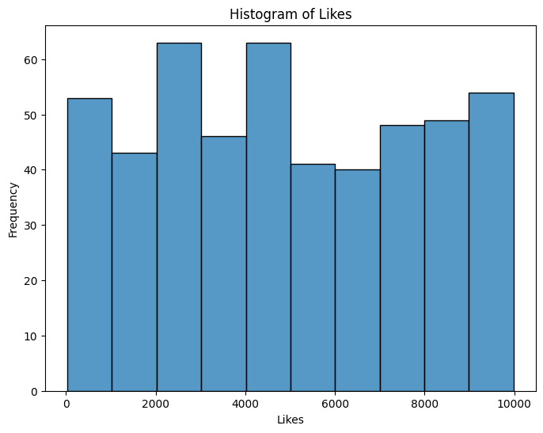
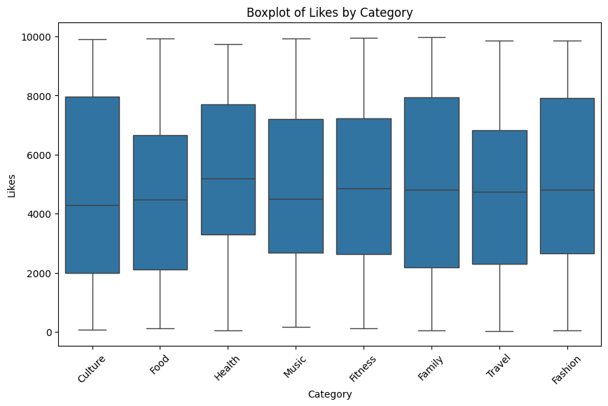

### Project | Coursera Project Network

# Clean and analyze social media usage data with Python

## Project Scenario

Suppose you work for a social media marketing company that specializes in promoting brands and products on a popular social media platform. Your team is responsible for analyzing the performance of different types of posts based on categories, such as health, family, food, etc. to help clients optimize their social media strategy and increase their reach and engagement.

They want you to use Python to automatically extract tweets posted from one or more categories, and to clean, analyze and visualize the data. The team will use your analysis to making data-driven recommendations to clients to improve their social media performance. This feature will help the marketing agency deliver tweets on time, within budget, and gain fast results.

## Project Objectives

Increase client reach and engagement

Gain valuable insights that will help improve social media performance

Achieve their social media goals and provide data-driven recommendations

## Your Challenge

Your task will be taking on the role of a social media analyst responsible for collecting, cleaning, and analyzing data on a client's social media posts. You will also be responsible for communicating the insights and making data-driven recommendations to clients to improve their social media performance. To do this, you will set up the environment, identify the categories for the post (fitness, tech, family, beauty, etc) process, analyze, and visualize data.

In this project, we'll use data from Twitter; however, to keep this project unique and open-ended, please feel free to choose whichever major social media website you'd prefer.

After you perform your analysis, you will share your findings.

## Result

## Conclusion

As a software engineer specializing in Artificial Intelligence and Computer Science, this project offered a comprehensive demonstration of my data handling, analysis, and visualisation skills using Python and Pandas. The process involved several key steps, each contributing to a meaningful analysis of the social media data.

The initial phase encompassed data generation, wherein I created a dataset simulating social media engagement with diverse categories like Food, Travel, Fashion, Fitness, Music, Culture, Family, and Health. This was achieved through Pandas' DataFrame functionalities, random data generation using NumPy and Python's random module.

One notable challenge I faced was ensuring data cleanliness. Cleaning involved handling null values, eliminating duplicates, and converting data types to facilitate analysis. Employing Pandas' 'dropna()', 'drop_duplicates()', and type conversion functions enabled me to address these challenges efficiently.

Visualisation was a crucial aspect of the analysis. Utilising Seaborn and Matplotlib, I generated a histogram illustrating the distribution of 'Likes' and a boxplot revealing 'Likes' across different categories. These visuals allowed for easy comprehension of data patterns and outliers.

The statistical analysis included computing the mean of the 'Likes' category and the mean 'Likes' for each category using Pandas' 'mean()' function and 'groupby()' method, respectively.

What distinguishes this project is not just the technical execution but the problem-solving approach. The ability to generate synthetic data resembling real-world scenarios and subsequently clean, visualize, and analyze it showcases a holistic understanding of data handling methodologies.

To enhance this project further, considering additional statistical analyses like correlations between categories or implementing machine learning models for predictive analytics could be beneficial. Additionally, integrating interactive visualizations or deploying this analysis as a web-based dashboard might provide a more accessible interface for users.

For portfolio artefacts, including image files of the generated graphs along with annotated code excerpts explaining the code's purpose and snippets demonstrating the data cleaning, visualization, and statistical analysis steps would be beneficial.

Overall, this project exemplifies my proficiency in handling data, problem-solving capabilities, and a forward-thinking approach towards enhancing project functionalities, making it a standout addition to my portfolio.
